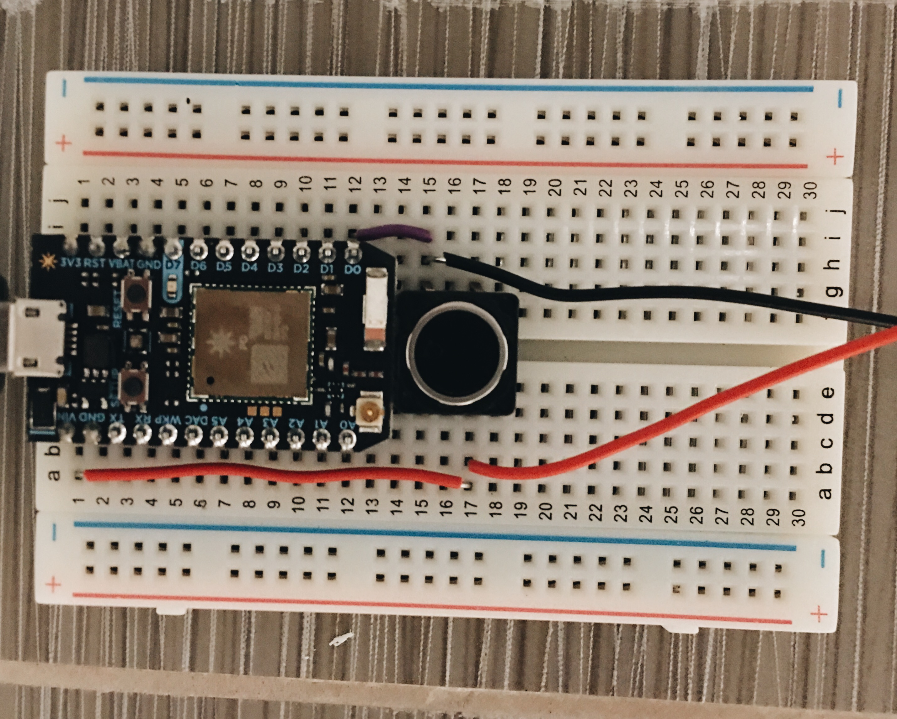
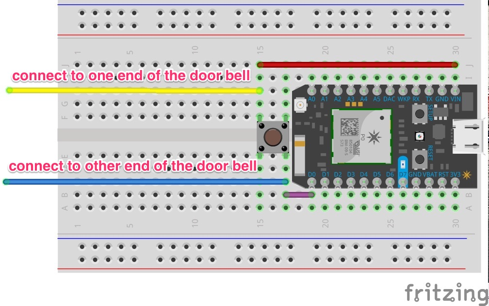
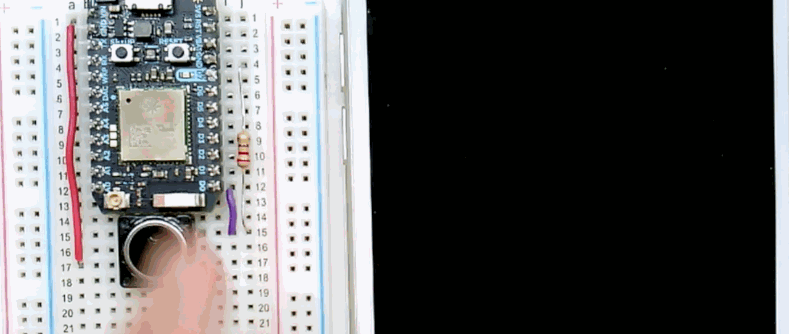

# Door bell

> Send an IFTTT notification on your mobile when the door bell is pressed

## Quick start

1. Wire up the [Particle Photon](https://store.particle.io/collections/photon)

  
- Flash the [firmware](firmware/bell.ino) on [Particle Photon](https://store.particle.io/collections/photon) and add the [door bell recipe on IFTTT](https://ifttt.com/recipes/382714-door-bell-notification)
- Press the push button to simulate a bell press or connect the 2 ends to the actual door bell to trigger a notification

  

## License

MIT
